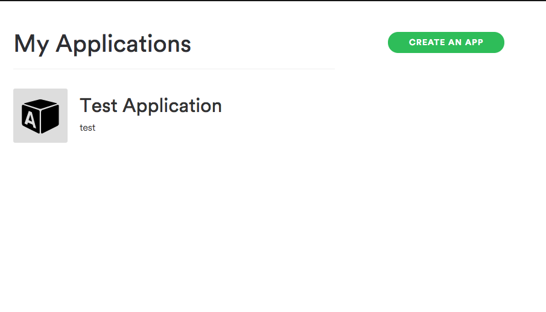
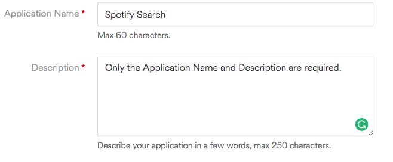
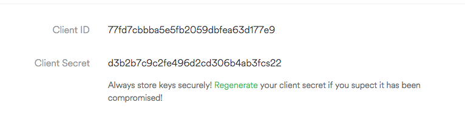

# Node Spotify API 🚀 🎶 

A simple to use API library for the Spotify REST API. 

## Installation

`npm install --save node-spotify-api`

## API

Currently the only method available is `search` 🤷‍♂️:

```js
search: function({ type: 'artist OR album OR track', query: 'My search query', limit: 20 }, callback);
```

## Example

```js
var Spotify = require('node-spotify-api');

var spotify = new Spotify({
  id: <your spotify client id>,
  secret: <your spotify client secret>
});

spotify.search({ type: 'track', query: 'All the Small Things' }, function(err, data) {
  if (err) {
    return console.log('Error occurred: ' + err);
  }

console.log(data); 
});
```

Note: The `limit` property is optional and the search will default to 20 if one is not supplied.

### Usage with Promises

This package also optionally works with promises. Just omit the callback parameter and the search method returns a promise object containing the response:

```js
var Spotify = require('node-spotify-api');

var spotify = new Spotify({
  id: <your spotify client id>,
  secret: <your spotify client secret>
});

spotify
  .search({ type: 'track', query: 'All the Small Things' })
  .then(function(response) {
    console.log(response);
  })
  .catch(function(err) {
    console.log(err);
  });
```

### Don't have a Spotify client id and client secret?

The Spotify API requires an authentication token to work. This package will perform all of the work of generating an authentication token for you, but you will still need to supply a client id and client secret.

Sign up for a Spotify developer account [here](https://developer.spotify.com/my-applications/#!/login). If you already have a Spotify account, you'll just have to log in. A membership can be paid or free, it makes no difference when it comes to using the Spotify API.

Once you're signed up, navigate to <https://developer.spotify.com/my-applications/>. You should be presented with the following page:



Click the button to "Create An App". Once you're at the next page, fill in the required fields.



Submit the form and on the next page, you should be presented with a client id and secret.



And you're all set!! 🎉 
